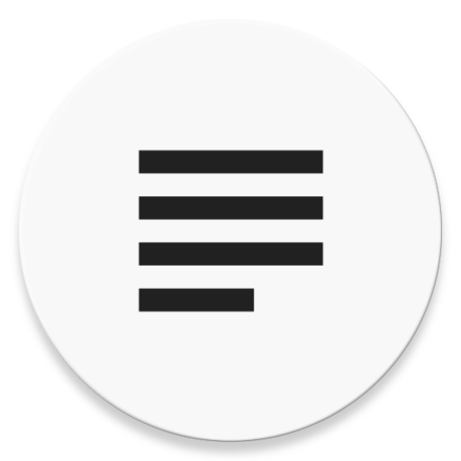

<!--
*** Thank you @othneildrew for this awesome template!!1
-->

![MIT License][badge-license]
![Language][badge-language]
![Downloads][badge-downloads]
![Contributors][badge-contributors]

<!-- PROJECT LOGO -->
<br />
<p align="center">
  <a href="https://github.com/ttomovcik/quickly">
    
  </a>

  <h2 align="center">Quickly</h2>

  <p align="center">
    Simple To-Do app for Android.
    <br />
    <a href="https://github.com/ttomovcik/quickly/releases"><strong>Download for Android »</strong></a>
    <br />
    <br />
    <a href="https://github.com/ttomovcik/quickly">About Quickly</a>
    ·
    <a href="https://github.com/ttomovcik/quickly/issues">Report Bug</a>
    ·
    <a href="https://github.com/ttomovcik/quickly/issues">Request Feature</a>
  </p>
</p>


<!-- TABLE OF CONTENTS -->
## Table of Contents

* [About the Project](#about-the-project)
  * [Built With](#built-with)
* [Getting Started](#getting-started)
  * [Prerequisites](#prerequisites)
  * [Installation](#installation)
* [Usage](#usage)
* [Roadmap](#roadmap)
* [Contributing](#contributing)
* [License](#license)
* [Contact](#contact)
* [Acknowledgements](#acknowledgements)


<!-- ABOUT THE PROJECT -->
## About The Project

[![Quickly screenshot][screenshot]](https://github.com/ttomovcik/quickly)

I seriously don't know how to describe a To-Do app. Like - oh, you type stuff that you want to do eventually and this app reminds you to do so. Idk fellas. This readme will be updated later.

### Features
* It can show you stuff you saved
* Idk, works?


### Built With
* [Android Studio](https://developer.android.com/studio)
* [Gradle](https://gradle.org/)

<!-- GETTING STARTED -->
## Getting Started

Want to customize Quicly or just get the lastest version from GitHub? Look no mo' fam. We got you covered.

### Prerequisites

Here's what you're gonna need.
* Android Studio
* AVD or phone running Android.

### Installation

1. Make sure you have Android Studio 3.x installed with Build tools 29.0.0
2. Clone the repo
```sh
git clone https:://github.com/ttomovcik/quickly.git
```
3. Import this project into Android Studio
```sh
Android Studio -> Import project (Gradle, eclipse, ADT, etc.)
```
4. Build the project and run the app in VM or physical device.

> No tests are implemented yet.

Or, you can get Quicly from **F-droid** store or **Google Play Store**.

## Usage

If you really don't know how to use a To-Do app, I have no idea how to help you. Except:

_For more help, please refer to the [**Wiki page**](https://github.com/ttomovcik/quickly/wiki)_

## Roadmap

See the [_**open issues**_](https://github.com/ttomovcik/quickly/issues) for a list of proposed features (and known issues).
Or the [_**projects tab**_](https://github.com/ttomovcik/quickly/projects) for a list of stuff that's being currently worked on). All the magic is happening in the _**develop/**_ branch. Only stable code in in the _**master/**_ branch.

## Contributing

Contributions are what make the open source community such an amazing place to be learn, inspire, and create. Any contributions you make are **greatly appreciated**.

1. Fork the Project
2. Create your Feature Branch (`git checkout -b feature/featureName`)
3. Commit your Changes (`git commit -m 'Added feature'`)
4. Push to the Branch (`git push origin feature/featureName`)
5. Open a Pull Request


## License

Distributed under the MIT License. See `LICENSE` for more information.

## Contact

Tomáš Tomovčík - [@ttomovcik](https://ttomovcik.github.io) - tomovcik.tomas@gmail.com

Project Link: [https://github.com/ttomovcik/quickly](https://github.com/ttomovcik/quickly)

## Acknowledgements

* [Literally, the best Readme template](https://github.com/othneildrew/Best-README-Template)
* [Google Material Design](https://material.io/develop/android/)


<!-- MARKDOWN LINKS & IMAGES -->
<!-- https://www.markdownguide.org/basic-syntax/#reference-style-links -->
<!-- Badges -->
[badge-license]: https://img.shields.io/github/license/ttomovcik/quickly?color=00CC6A&style=flat-square
[badge-language]: https://img.shields.io/github/languages/top/ttomovcik/quickly?color=E81123&style=flat-square
[badge-downloads]: https://img.shields.io/github/downloads/ttomovcik/quickly/total?color=0078D7&style=flat-square
[badge-contributors]: https://img.shields.io/github/contributors/ttomovcik/quickly?color=EA005E&style=flat-square

<!-- Others -->
[screenshot]: https://github.com/ttomovcik/quickly/raw/develop/docs/screenshots/placeholder.jpeg
